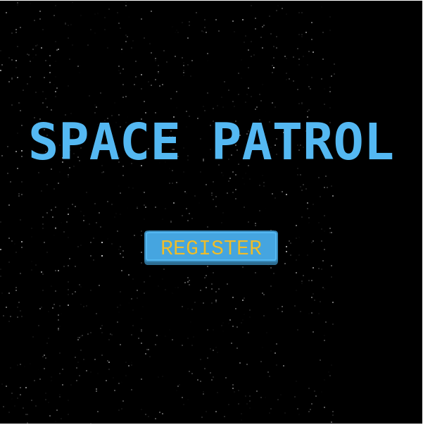
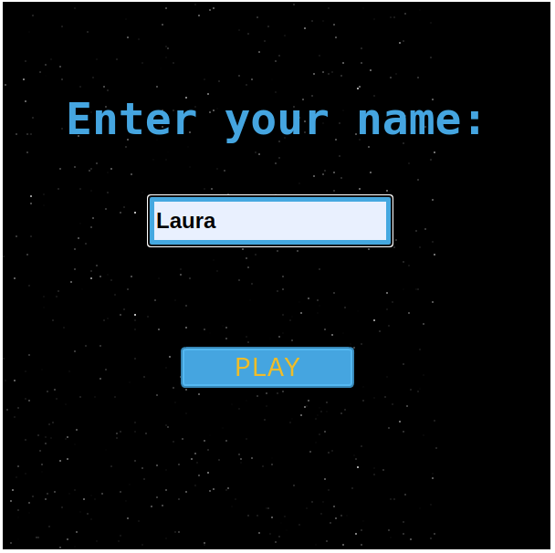
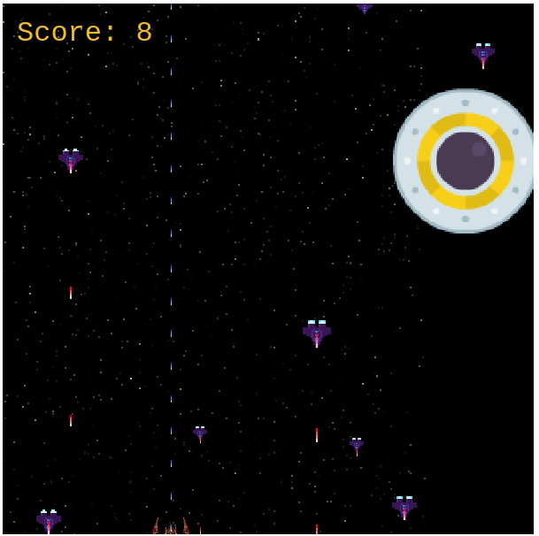
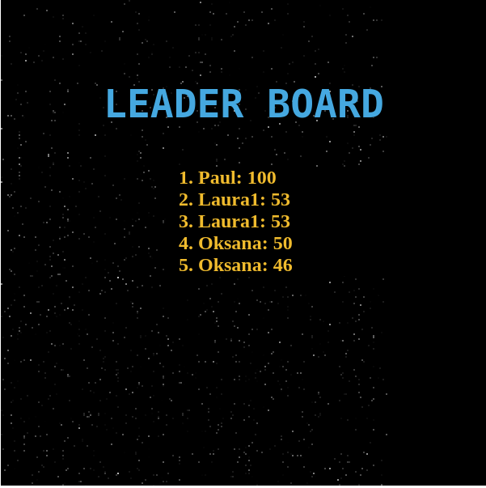

# SPACE PATROL
Creating a shooter - game using Phaser3 and Webpack.

## Built With
 - HTML
 - CSS
 - JS
 - Webpack
 - Phaser3
 - Jest

## Live Demo

[Live demo](https://rawcdn.githack.com/Laguna1/shooter-game/ca3bf83f888ff93257f46940dc842cb00895cb59/dist/index.html)

## About the game:
#### The main character 
- is a spaceship commander who patrols his sector of responsibility.
#### The goal 
- is to keep the ship intact during the mission, to pass as few enemies or dangerous objects through your sector as possible. You should avoid approaching, direct contact with the enemy or direct hit by an enemy shot - in this case, the mission is defeated.
#### Available weapon 
- a laser that fires directly in front of you each time you press the "space" key
#### Mobility 
- the ship can move forward, backward, right, left.
#### The enemies 
- a squadron of alien ships and asteroids - can be destroyed by shots.
### How to play
- Move the player using the arrows on the keyboard, shoot with the space bar on the keyboard

## Installation and Usage
 - Clone the repository git clone https://github.com/Laguna1/shooter-game
 - cd shooter-game
 - Run `npm i` to get all the dependencies.
 - Run `npm run build` for one time build of bundle after changes.
 - Run `npm start` to start the server.
   By default after that game will be available on:
  http://127.0.0.1:8080 or
  http://192.168.0.108:8080

## Tests
- Run `npm run test` for testing
 

## Author

👤 **Oksana Petrova**
 - Github:[@Laguna1](https://github.com/Laguna1)
 - Linkedin: [Oksana Petrova](https://www.linkedin.com/in/oksana-petrova-005bb0145/)
 - Twitter: [Oksana Petrova](https://twitter.com/OksanaP48303303)

🤝 Contributing

Contributions, issues and feature requests are welcome!

Feel free to check the issues page. 

Show your support

Give a ⭐️ if you like this project! 

Acknowledgments

Thanks to Microverse for making this possible!

#### The images, sprites and sounds from  [OpenGameArt](https://opengameart.org/art-search?keys=shooter)
